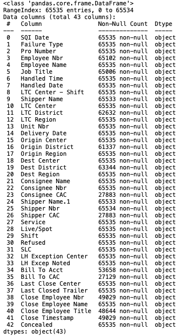
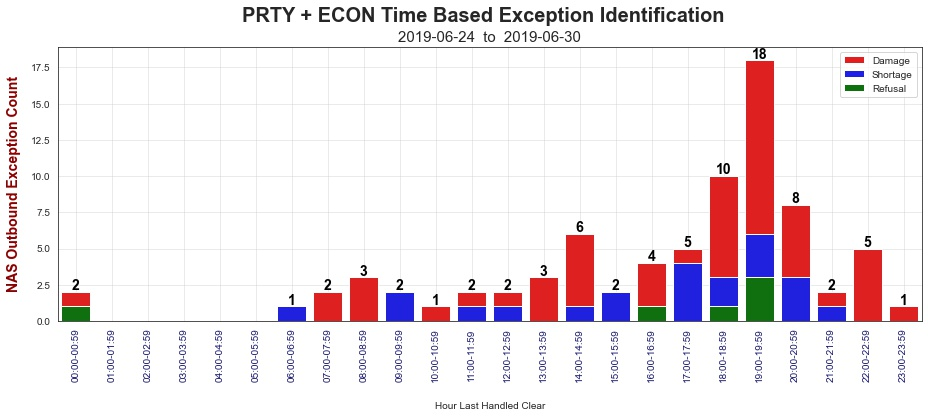
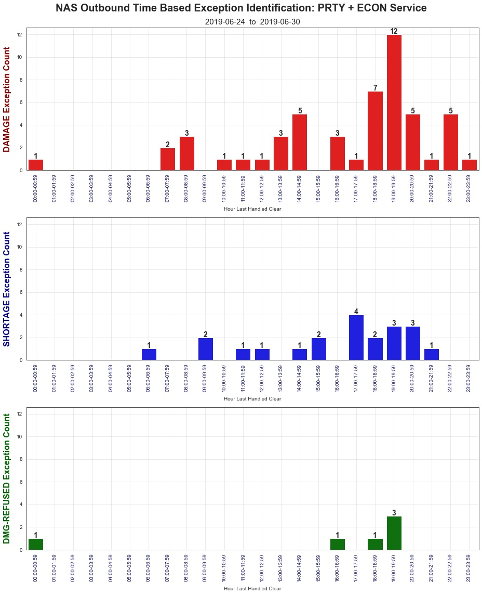
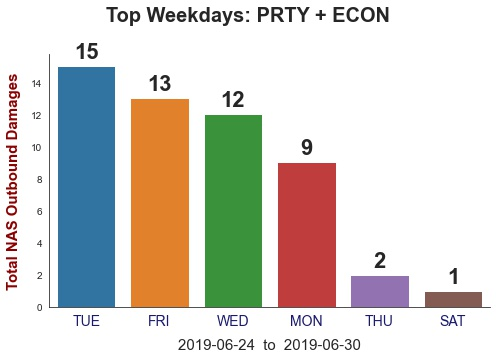
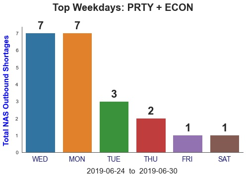
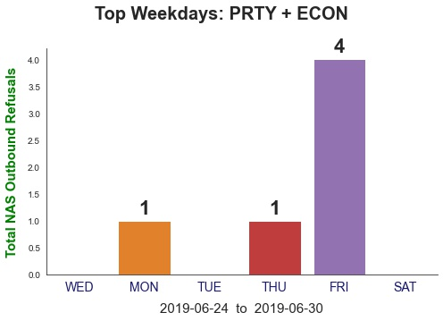
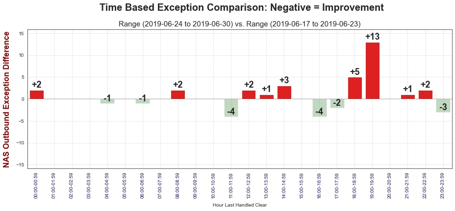

# Time Based Identification

[Initial Data Link  ](https://drive.google.com/file/d/1h3tAEjL8bKB7BtAA86EeeXlxBFUhopkM/view?usp=sharing)
[  Python Code Link](src="shell.py)

<h3 align="center">My project demonstrates my ability to utilize Python, SQLite, Matplotlib, and Seaborn to create unique visuals to better highlight improvement opportunities not currently explored.</h3>

Initial import from Google Drive & cleaned by removing columns with high precentages of null values, changing data types, replacing missing values where appropriate, and adding new calculated columns. Data is then pushed to SQLite using SQLalchemy.

The app takes in user inputs to select date ranges via SQL, shifts, exception catagories, and service levels to return totals visualized over an entire 24 hour day:

<h2 align="left"> Further exploration with exception-level breakouts and totals by day of the week: </h2>

<h2 align="left"> Compare totals with another date range, visualizing further opportunities: </h2>

